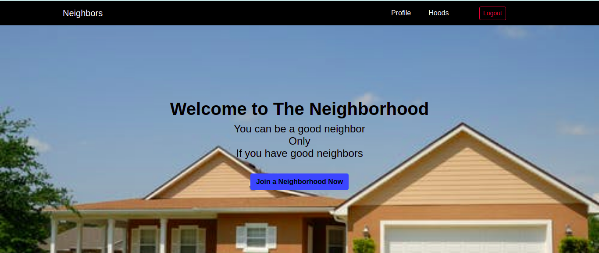
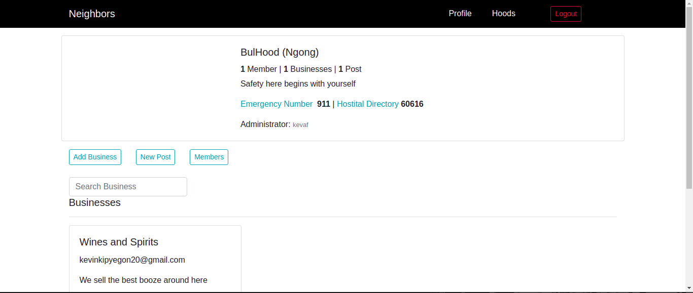

# --NEIGHBORHOOD--

## Description
The neighborhood application helps people living in the same neighbourhood interact together and help them be aware of essential services around them like for instance Hospitals and the POlice Stations. Also this app comes in handy for people moving in to the area as all that they need are in one place and they only need to sign up and access the information.

## Setup/Installations.
1. A PC mainly with an Operating system.
2. Python3.8 or later is installed in your PC.
3. Postgresql installed
4. clone the directory into your local machine
5. navigate to the cloned folder by cd keffavv-neighborhood
6. Create a virtual environment
7. run source virtual/bin/activate
8. pip install requirements.txt
9. run python3.8 manage.py runserver
10. The application should work
11. for the test run python manage.py test Awards

## Technologies Used
1. Python
2. Flask
3. Heroku - Deployment
4. HTML
5. CSS/Bootstrap

## Author & Contact Information.
This web app was created by Kevin Kipyegon. If you have any suggestions or improvements you can reach the author via mail at kevin.kipyegon@student.moringaschool.com.

## Project Screenshot

## Liscence.
This is an open source project avaiable under the [MIT Liscence](LISCENCE).